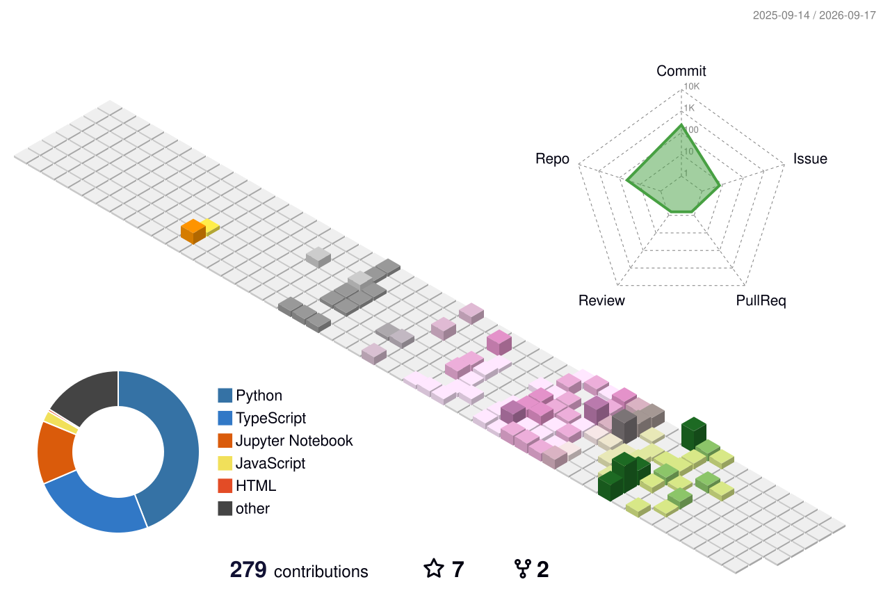

<!-- ═════════════════ ANIMATED HEADER ═════════════════ -->
<div align="center">


<br/><br/>

<a href="mailto:adtya25069@gmail.com"></a>
<a href="https://www.linkedin.com/in/adityasingh25063/"></a>
<a href="mailto:adtya25069@gmail.com"></a>


</div>

<!-- ═════════════════ 3D CONTRIBUTION GRAPH ═════════════════ -->

##  Contribution Skyline — 3D

<div align="center">

<picture>
  <source media="(prefers-color-scheme: dark)" srcset="./profile-3d-contrib/profile-night-rainbow.svg" />
  
</picture>

</div>

<!-- ═════════════════ ABOUT ═════════════════ -->

##  About

```yaml
role: Backend & AI Systems Engineer
education: B.Tech CSE @ VIT Bhopal (2022–2026)
research: IIT Ropar — formal verification of Mosquitto MQTT broker (Spin / Promela)
focus:
  - Agentic LLM backends — plan → tool-call → act loops on the Claude API
  - MCP servers for natural-language control of real systems
  - High-throughput distributed systems in Go — gRPC, Kafka, Kubernetes
ships: schema → API → agent loop → tests → CI/CD → deploy
status: OPEN TO WORK — SDE-1 / AI-GenAI Engineer
```

- 🔭 Building **Gravitas** — an LLM agent backend where Claude **plans, calls tools, and acts** through a multi-step tool-use loop, exposed via a custom **7-tool MCP server** controllable from Claude Desktop & Claude Code
- 🔬 **Research Intern @ IIT Ropar** — modeled the Mosquitto MQTT broker in **Promela**, verified message-delivery + deadlock-freedom with the **Spin model checker**; shipped a FastAPI + PostgreSQL research-publications platform
- ⚡ Engineered a **Go matching engine — 500K+ orders/sec** over gRPC + Protobuf on a Kafka event-driven backbone
- 🧪 **90%+ pytest coverage** · GitHub Actions CI/CD · Prometheus · Grafana · Jaeger (OpenTelemetry)

<div align="center"></div>

<!-- ═════════════════ TECH STACK ═════════════════ -->

##  Tech Arsenal

<div align="center">

### Languages & Backend


### Infra · DevOps · Observability


### AI Systems


### Protocols · Auth · Testing


</div>

<div align="center"></div>

<!-- ═════════════════ PROJECTS ═════════════════ -->

##  Flagship Builds

<table>
<tr>
<td width="50%" valign="top">

### 🧠 [Gravitas](https://github.com/addy-25/Gravitas)
**LLM Agent Backend Platform**

`Python` `FastAPI` `PostgreSQL` `Redis` `Claude API` `MCP`

Claude doesn't just answer — it **plans, calls tools, and acts on results** through a multi-step agentic loop.

- 🔧 Custom **7-tool MCP server** → natural-language control from Claude Desktop/Code
- 🔐 GitHub OAuth 2.0 + **HMAC-SHA256** signed webhooks
- ✅ Async stack · Alembic · JWT · **90%+ pytest coverage** · CI/CD

</td>
<td width="50%" valign="top">

### ⚡ [QuantFlow](https://github.com/addy-25/QuantHFT)
**AI-Controlled Trading Platform**

`Go` `Kafka` `gRPC` `Docker` `Kubernetes` `MCP`

MCP server exposing trading functions as AI-callable tools — **Claude executes real trades end-to-end** via natural language.

- 🚀 Go matching engine: **500K+ orders/sec** over gRPC + Protobuf
- 📡 **Kafka** event architecture across 3 topics feeding the agent live data
- 📊 7 services on K8s · Prometheus · Grafana · Jaeger (OTel)

</td>
</tr>
<tr>
<td colspan="2" valign="top">

### 📰 [FeedFlow](https://github.com/addy-25/FeedFlow) — LLM Content-Scoring Pipeline

`Python` `FastAPI` `Celery` `Claude API` `PostgreSQL` `React Native`

Claude scores incoming content **0–100 against each user's stored preferences**, rationale persisted to PostgreSQL. Runs as an **async Celery + Redis pipeline** decoupled from the request path — API stays fast under load. Per-user scheduled jobs via **Celery Beat** (15 min → daily) · shipped with a **React Native (Expo)** client.

</td>
</tr>
</table>

<div align="center"></div>

<!-- ═════════════════ SNAKE ═════════════════ -->

##  Contribution Graph — Consumed

<div align="center">

<picture>
  <source media="(prefers-color-scheme: dark)" srcset="https://raw.githubusercontent.com/addy-25/addy-25/output/github-contribution-grid-snake-dark.svg" />
  
</picture>

</div>

<!-- ═════════════════ STATS ═════════════════ -->

##  Stats & Activity

<div align="center">


<br/><br/>


<br/><br/>


<br/><br/>


</div>

<!-- ═════════════════ FOOTER ═════════════════ -->

<div align="center">


<br/><br/>

**⚡ Open to SDE-1 / AI-GenAI Engineer roles — let's build something.**


</div>
